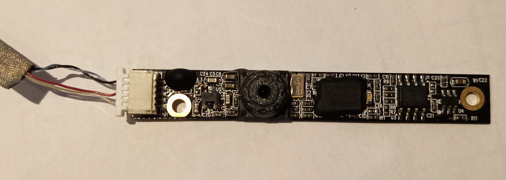
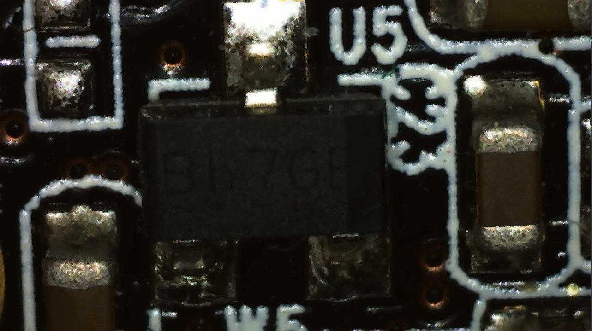
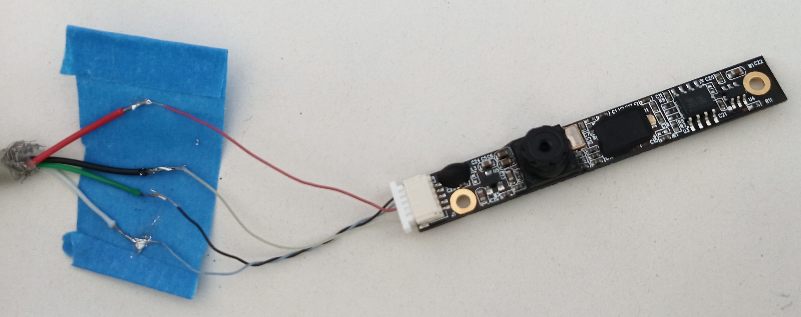

# Salvage webcam from a dead HP Pavillon laptop

## what for? A mailbox inspector for the lazy :)

### Hardware

1. disassemble carefully the screen

1. Put aside the LCD, it can be reused (for example for a magic mirror project!)

1. Carefully remove the webcam, keeping the cable

1. While you're at it, you can salvage the microphones (on mine, there were two), and the Wifi antenna extensions (two as well on mine)

### Wiring

1. Try to understand the wires colors

    This can largely vary depending on your webcam. Some have four wires, other five.

    Here is mine (S/N is CN0314-0v02 AT25):

    

    The twisted pair (black grey wires on top) is most probably the data lines. Let's guess DATA+ and DATA-. Could be the opposite.

    By using a continuity tester on my multimeter,  I quickly found that the whitish~lime wire at the bottom is ground GND (test with the screw holes). It is then obvious that the red is VCC+.

1. The USB cable to prepare

    There are four wires in a USB cable:

    * black for GND

    * red for VCC (+5V)

    * green is DATA+

    * white is DATA-

    Apparently, it is a good idea to not power the camera straight with 5V. It might not fry it immediatly, but it will probably overheat quickly.

    So, based on a tip found in [Instructables](https://www.instructables.com/id/Salvaging-and-Reusing-an-Old-Laptop-Camera-to-USB-/), a good idea is to drop the 5V voltage to 3.3V.

    The most efficient and safe will be __two 1N1004 diodes in series or one single 1N4004 diode__. This will do the proper voltage drop and also protect the camera board from reverse polarity if you screw up ;)

    However, it appears that on the model I used, a voltage regulator is present:
        
    I powered the VCC with +5V, then measured the voltage on both pins of the voltage regulator, and found that is was outputing 3.3V on one, 5V on the other. My deduction is that there is no need for diodes on the input, it is safe to to directly connect a USB cable to the board.

1. Make it USB!

    Here is the final correspondance table in the case of my board:
    | USB | Camera | usage |
    |-----|-----|-----|
    | black | whitish~lime | GND |
    | red | red | +VCC |
    | green | black | DATA+ |
    | white | grey | DATA- |

    

    I then issued the following command: ```tail -f /var/log/kern.log```, then plugged the USB cable, and this was the output:
```
Apr  9 16:24:20 Ryzen1800X kernel: [619503.095802] usb 1-2: new high-speed USB device number 98 using xhci_hcd
Apr  9 16:24:20 Ryzen1800X kernel: [619503.338901] usb 1-2: New USB device found, idVendor=064e, idProduct=a101, bcdDevice= 1.00
Apr  9 16:24:20 Ryzen1800X kernel: [619503.338903] usb 1-2: New USB device strings: Mfr=2, Product=1, SerialNumber=3
Apr  9 16:24:20 Ryzen1800X kernel: [619503.338904] usb 1-2: Product: HP Webcam
Apr  9 16:24:20 Ryzen1800X kernel: [619503.338905] usb 1-2: Manufacturer: SuYin
Apr  9 16:24:20 Ryzen1800X kernel: [619503.338905] usb 1-2: SerialNumber: CN0314-OV02-VH-R03.02.02
Apr  9 16:24:20 Ryzen1800X kernel: [619503.344926] uvcvideo: Found UVC 1.00 device HP Webcam (064e:a101)
Apr  9 16:24:20 Ryzen1800X kernel: [619503.403005] uvcvideo 1-2:1.0: Entity type for entity Extension 4 was not initialized!
Apr  9 16:24:20 Ryzen1800X kernel: [619503.403006] uvcvideo 1-2:1.0: Entity type for entity Processing 3 was not initialized!
Apr  9 16:24:20 Ryzen1800X kernel: [619503.403007] uvcvideo 1-2:1.0: Entity type for entity Camera 1 was not initialized!
Apr  9 16:24:20 Ryzen1800X kernel: [619503.403056] input: HP Webcam as /devices/pci0000:00/0000:00:01.3/0000:03:00.0/usb1/1-2/1-2:1.0/input/input101
```
You can also use ```lsusb```, which in my case showed:
```
Bus 006 Device 001: ID 1d6b:0003 Linux Foundation 3.0 root hub
Bus 005 Device 002: ID 051d:0002 American Power Conversion Uninterruptible Power Supply
Bus 005 Device 001: ID 1d6b:0002 Linux Foundation 2.0 root hub
Bus 004 Device 001: ID 1d6b:0003 Linux Foundation 3.0 root hub
Bus 003 Device 001: ID 1d6b:0002 Linux Foundation 2.0 root hub
Bus 002 Device 001: ID 1d6b:0003 Linux Foundation 3.0 root hub
Bus 001 Device 099: ID 064e:a101 Suyin Corp. Acer CrystalEye Webcam
Bus 001 Device 026: ID 1bcf:0005 Sunplus Innovation Technology Inc. Optical Mouse
Bus 001 Device 002: ID 046d:c30a Logitech, Inc. iTouch Composite
Bus 001 Device 001: ID 1d6b:0002 Linux Foundation 2.0 root hub
```
(Device 099 is the one)
I then checked the image with VLC capture video device, which worked fine.

### The plan

1. Software

    I won't go into much details, and only say that if you did the job properly, when plugging the USB cable, the camera should be recognised as USB device.

    To test, I am using Raspbian on a Raspberry 3, it is then easy to take a snapshot or record a movie using one of the following command line utils:

    * webcam

    * streamer

    * fswebcam

1. Tying it all together

    @TODO

1. Going further

    The idea is now to have an ESP32 board running MicroPython drive the webcam + a white led, and take regular snapshots, each picture replaces the previous one. One could use also a NodeMCU board running LUA.

    A minimal webserver will be serving the picture upon a POST request with a specific security token.

    I will be able to query this via my home Wifi network.

    As my mailbox is quite far from my Wifi router, and my home has thick stone walls, if my Wifi signal is too weak I might need to swap the ESP32 for a WiPy board and throw in an external Wifi antenna to boost the signal.
